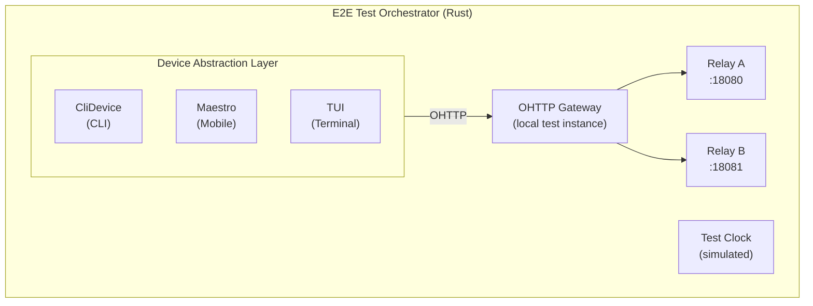

<!-- SPDX-FileCopyrightText: 2026 Mattia Egloff <mattia.egloff@pm.me> -->
<!-- SPDX-License-Identifier: GPL-3.0-or-later -->

> **Mirror:** This repo is a read-only mirror of [gitlab.com/vauchi/e2e](https://gitlab.com/vauchi/e2e). Please open issues and merge requests there.

[](https://gitlab.com/vauchi/e2e)
[](https://api.reuse.software/info/gitlab.com/vauchi/e2e)

> [!NOTE]
> **You're early — and that's the point.** Vauchi is pre-alpha and
> under heavy development: not yet ready for production, and APIs may
> change without notice. If you're here now, you can help shape it —
> try it, break it, and tell us what's missing.

# Vauchi E2E Testing Infrastructure

End-to-end testing framework for multi-user,
multi-device, cross-platform scenarios.

## Prerequisites

### Phase 1: CLI Testing (Current)

| Requirement | Check Command | Install |
|-------------|---------------|---------|
| Rust toolchain | `rustc --version` | [rustup.rs](https://rustup.rs) |
| CLI, relay, OHTTP relay binaries | `just e2e-build` | Built from source |

```bash
# Build all three binaries into target/e2e-bin (SHA-cached, rebuilds
# only what changed)
just e2e-build

# Run CLI-based tests
just e2e-run test_cli_to_cli_exchange
```

> **Use `just e2e-build`, not `just build cli`.** The harness drives
> time-dependent scenarios (clock skew, deletion grace periods) through
> `VAUCHI_TEST_CLOCK_EPOCH`, which the CLI only honors when compiled with
> `--features e2e-test-clock`. `just e2e-build` passes it; a plain
> `just build cli` does not, and the resulting binary ignores the test
> clock — tests then fail on a real grace period
> (`Grace period has not elapsed`) rather than on anything you changed.
>
> The harness looks for binaries in `$E2E_BIN_DIR`, then `target/e2e-bin`,
> then `cli/target/debug` as a last resort. CI sets `E2E_BIN_DIR`.

### Phase 2: Mobile Testing (Maestro)

| Requirement | Check Command | Install |
|-------------|---------------|---------|
| Maestro CLI | `maestro --version` | [Reviewed, pinned release][maestro-releases] |
| Android SDK | `echo $ANDROID_HOME` | [Android Studio](https://developer.android.com/studio) |
| Android emulator | `emulator -list-avds` | Android Studio AVD Manager |
| Xcode (iOS, macOS only) | `xcodebuild -version` | Mac App Store |
| iOS Simulator (macOS only) | `xcrun simctl list` | Xcode |

> **Quick check:** Run `just maestro-setup` to verify your entire Maestro
> environment in one step. It checks the CLI, iOS tooling, Android tooling,
> and available flow files.

**Android Setup:**

```bash
# Verify environment
export ANDROID_HOME=/path/to/Android/Sdk
export ANDROID_SDK_ROOT=$ANDROID_HOME
export PATH=$PATH:$ANDROID_HOME/emulator:$ANDROID_HOME/platform-tools

# List available emulators
$ANDROID_HOME/emulator/emulator -list-avds

# Start emulator
$ANDROID_HOME/emulator/emulator -avd Pixel_7 &

# Verify Maestro can see device (explicit platform)
maestro test --platform android e2e/maestro/android/create_identity.yaml
```

**iOS Setup (local macOS):**

```bash
# Boot a simulator
xcrun simctl boot "iPhone 15 Pro"

# Install the app (from ios/ repo)
cd ios && xcodebuild -scheme Vauchi \
  -destination 'platform=iOS Simulator,name=iPhone 15 Pro' \
  -configuration Debug build

# Verify Maestro can see simulator (explicit platform)
maestro test --platform ios e2e/maestro/ios/create_identity.yaml
```

### Phase 3: TUI Testing (expectrl)

| Requirement | Check Command | Install |
|-------------|---------------|---------|
| TUI binary | `just build` | Built from source |
| expectrl | Cargo dependency | Added to Cargo.toml |

## Environment Variables

```bash
# Android
export ANDROID_HOME=/home/$USER/Android/Sdk
export ANDROID_SDK_ROOT=$ANDROID_HOME
export PATH=$PATH:$ANDROID_HOME/emulator:$ANDROID_HOME/platform-tools

# Maestro
export PATH=$PATH:$HOME/.maestro/bin
export MAESTRO_CLI_NO_ANALYTICS=true  # Optional: disable analytics

# macOS Remote (for iOS)
export MACOS_VM_IP=192.168.x.x
export MACOS_VM_USER=username
export PROJECT_PATH=/Volumes/Workspace/vauchi
```

## Running Tests

### CLI E2E (Rust harness)

```bash
# List all E2E tests
just e2e

# Run specific test
just e2e-run test_cli_to_cli_exchange
just e2e-run test_multi_device_cli_linking

# Run all tests
just e2e-run all

# Run with verbose output
RUST_LOG=debug just e2e-run all
```

### Mobile E2E (Maestro)

```bash
# Check environment first
just maestro-setup

# Run a single iOS flow
just e2e-ios create_identity
just e2e-ios generate_qr

# Run a single Android flow
just e2e-android create_identity
just e2e-android complete_exchange

# Run all flows on both platforms
just e2e-maestro

# Run all flows on one platform
just e2e-maestro ios
just e2e-maestro android

# Run Rust-orchestrated mobile tests (requires booted devices)
just e2e-mobile
```

### All Platforms

```bash
# Full suite (CLI + Mobile)
just e2e-all
```

### CI lanes & coverage

Two lanes run the `vauchi-e2e-tests::it` integration tests:

- **smoke** (`test:smoke`) — the `smoke_*` subset, on every MR and main.
  Fast critical-path gate.
- **integration** (`test:integration`) — **every** non-ignored `::it`
  test, on main and schedules. The lane filter lives in
  `ci/integration-test-filter` (single source of truth).

You do **not** need a name prefix for a test to run: the integration
lane runs all of them. The `check:test-lane-coverage` job fails the
pipeline if any non-ignored `::it` test would run in no lane (the bug
that left 55 tests silently unrun — see problem
`2026-06-11-e2e-tests-invisible-to-ci`). Deliberately-excluded tests go
in `ci/test-coverage-allowlist.txt` with a reason; truly local-only
tests use `#[ignore]`.

## Test Status

| Test | Phase | Status | Notes |
|------|-------|--------|-------|
| CLI-to-CLI exchange | 1 | Working | Basic contact exchange |
| Multi-device linking | 1 | Working | Device pairing |
| Contact sync across devices | 1 | Working | Added device-link + exchange + sync certification |
| Five user exchange | 1 | Working | Full mesh exchange between five users |
| Visibility labels | 1 | Working | Label CRUD, field visibility per label |
| Recovery flow | 1 | Working | Social recovery with vouchers |
| Per-contact visibility | 1 | Working | Hide/show fields per contact |
| Backup & restore | 1 | New | Identity export/import — test not added yet |
| iOS Simulator | 2 | Skips gracefully | Detects booted simulator; full exchange needs built app |
| Android Emulator | 2 | Skips gracefully | Detects any device/emulator; full exchange needs APK install |
| TUI create identity | 3 | Working | PTY onboarding via expectrl |
| TUI exchange / device link | 3 | Blocked | Exchange Mode keyboard navigation not drivable |

## Architecture



> **Note:** The orchestrator includes an `OhttpRelayManager` that
> spawns a local OHTTP gateway, so tests can exercise the same
> client→gateway→relay transport path as production (per ADR-037).
> Today only OHTTP-specific test suites opt in via the
> `spawn_ohttp_stack` helpers; making OHTTP the default for all
> full-stack scenarios is tracked as a follow-up.

## Troubleshooting

### iOS XCTest driver timeout

**Symptom:** Maestro hangs for 30-60 seconds then fails with
`XCTest driver connection timed out` or `Failed to connect to XCTestRunner`.

**Cause:** When both an iOS simulator and Android emulator are running,
Maestro's auto-detection may attempt to connect to the Android device first
using the XCTest driver, which will never succeed.

**Fix:** Always pass `--platform ios` when targeting iOS. The `just` recipes
and the Rust `MaestroDevice` do this automatically:

```bash
# WRONG (may try Android driver first)
maestro test e2e/maestro/ios/create_identity.yaml

# CORRECT (explicit platform selection)
maestro test --platform ios e2e/maestro/ios/create_identity.yaml

# Best: use just recipes (--platform is automatic)
just e2e-ios create_identity
```

If the problem persists after using `--platform`:

```bash
# Verify a simulator is booted
xcrun simctl list devices booted

# Boot one if none are running
xcrun simctl boot "iPhone 15 Pro"

# Check Maestro can see it
maestro --platform ios hierarchy
```

### Android emulator not targeted correctly

**Symptom:** Maestro runs the flow on the iOS simulator instead of the
Android emulator, or fails with `No Android devices found`.

**Cause:** Without `--platform android`, Maestro may prefer the iOS
simulator when both are running.

**Fix:** Always pass `--platform android` when targeting Android:

```bash
# WRONG (may target iOS simulator)
maestro test e2e/maestro/android/create_identity.yaml

# CORRECT (explicit platform selection)
maestro test --platform android e2e/maestro/android/create_identity.yaml

# Best: use just recipes (--platform is automatic)
just e2e-android create_identity
```

If the problem persists:

```bash
# Verify ADB sees the emulator
adb devices

# Restart ADB if needed
adb kill-server && adb start-server

# Check ANDROID_HOME is set
echo $ANDROID_HOME
```

### Relay not starting

```bash
# Check if port is in use
lsof -i :18080

# Kill stale processes
pkill -f vauchi-relay
```

### Android emulator not detected by ADB

```bash
# Verify ADB sees device
adb devices

# Restart ADB server
adb kill-server && adb start-server

# Check emulator is running
emulator -list-avds
```

### iOS Simulator not connecting

```bash
# Verify booted simulators
xcrun simctl list devices booted
```

### Maestro not finding app

```bash
# Ensure app is installed on the correct platform
maestro --platform ios hierarchy    # iOS
maestro --platform android hierarchy  # Android

# Check app bundle IDs
# iOS: app.vauchi.ios
# Android: com.vauchi

# Use Maestro Studio for visual debugging
maestro studio
```

### Environment check fails

```bash
# Run the full environment diagnostic
just maestro-setup

# This checks: Maestro CLI, Xcode tools, Android SDK, ADB,
# booted simulators/emulators, and available flow files.
```

## Adding New Tests

1. Create test file in `tests/`
2. Use `Orchestrator` or `Scenario` DSL
3. Mark with `#[ignore]` until infrastructure ready
4. Add to test list in this README

Example:

```rust
#[tokio::test]
#[ignore = "requires Maestro and Android emulator"]
async fn test_android_exchange() {
    let mut orch = Orchestrator::new();
    orch.start().await.unwrap();
    // ... test implementation
    orch.stop().await.unwrap();
}
```

## See Also

- [Planning doc][planning]
- [Maestro docs](https://maestro.mobile.dev)

[planning]: ../_private/docs/problems/2026-02-17-maestro-e2e-environment-blockers/README.md
[maestro-releases]: https://github.com/mobile-dev-inc/Maestro/releases
